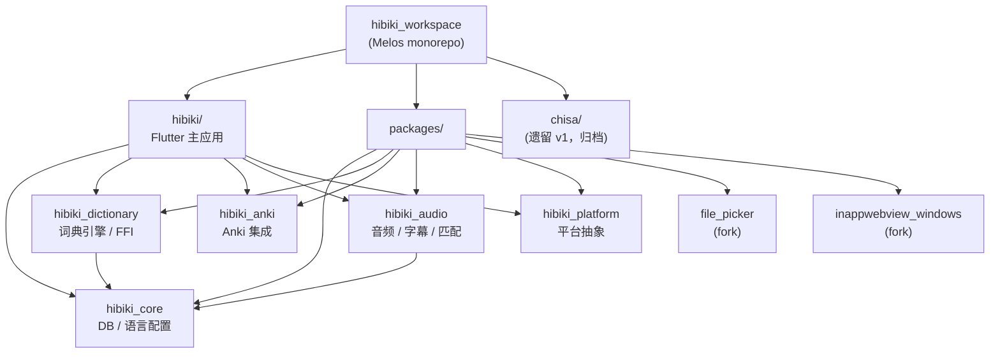

# Hibiki Agent Rules

本文件是 Claude/Codex 进入 Hibiki 仓库后的长期执行规则，不是项目宣传页。只保留会影响分析、修改、验证、审查和提交的内容；项目介绍放 README，细节设计放 docs。

## 基本规则

- 始终用中文回复。
- 代码审查（code review）spawn subagent 时，必须显式指定 `model: "opus"`，确保审查走 Opus 模型。
- 开始分析、修改、测试、提交或 PR 前，先读取最近层级的 `AGENTS.md`；如果子目录里还有更近的 `AGENTS.md`，按更近层级执行。
- 遇到功能异常、测试失败、运行时报错或用户要求修复时，必须做根因修复：先复现或沿真实代码路径定位，再修数据结构、状态同步、生命周期、平台边界或依赖契约。
- 不允许用延迟、重试、吞异常、硬编码、特例分支来掩盖症状。只有外部系统或平台限制不可控时，才允许临时兼容层，并说明影响范围和清理条件。
- 函数和新增 Dart helper 要有明确类型签名。
- 不从零重写现有功能；在当前实现上删减、合并、修正。
- 发现问题要直接说，不要为了顺滑而把风险说轻。

## 仓库地图

- 仓库根：`D:\APP\vs_claude_code\hibiki`
- Flutter app：`hibiki/`
- Android 工程：`hibiki/android/`
- 当前阅读器入口：`hibiki/lib/src/pages/implementations/reader_hoshi_page.dart`
- 当前书架入口：`hibiki/lib/src/pages/implementations/reader_hoshi_history_page.dart`
- 当前 reader source：`hibiki/lib/src/media/sources/reader_hoshi_source.dart`
- Drift 数据库：`hibiki/lib/src/database/database.dart` 和 `hibiki/lib/src/database/tables.dart`
- 审查报告：`docs/reviews/YYYY-MM-DD-project-review.md`
- 已复现回归：`docs/REGRESSION_BUGS.md`
- 测试证据：`.codex-test/`

## 当前技术事实

- Flutter `3.41.6` / Dart `3.11.4`，最低 Android API 24。
- 主存储是 Drift SQLite：`HibikiDatabase`，偏好也落在 Drift `preferences` 表。旧注释里出现的 `Isar` / `Hive` 不一定代表当前事实，先查代码再判断。
- EPUB 阅读器当前走 Hoshi 实现：`ReaderHoshiPage` / `ReaderHoshiSource`。`ReaderHoshiSource.uniqueKey`、`reader_ttu/hoshi://book/...` 和部分 `setTtu*` 方法名只是旧数据兼容边界，不代表当前还有 TTU 阅读器；不要在没有迁移方案时随手改持久化 key。
- 词典导入和查询核心走 `hoshidicts` C++ FFI；格式 UI 或旧 Dart format 类不一定代表真实导入路径。
- 国际化使用 Slang，源文件在 `hibiki/lib/i18n/*.i18n.json`，生成文件是 `strings.g.dart`。
- 有声书/字幕相关核心路径在 `hibiki/lib/src/media/audiobook/`，当前导入入口包括 `book_import_dialog.dart` 和 `audiobook_import_dialog.dart`。
- 旧 TTU 只保留迁移用途：`TtuMigrationServer` / `TtuIdbReader` / `assets/ttu-ebook-reader` 用来读取历史 IndexedDB 数据。当前阅读器问题不要去 `D:\ttu-fork` 修。

## UI 标准

### 平台自适应架构

Hibiki 是基于 Flutter 的多平台应用。UI 支持两种架构：Android 走 Material Design 3，iOS 走 Cupertino；Windows 桌面端复用 Material 架构并依赖 fork 的 `flutter_inappwebview_windows` 渲染 EPUB。架构分两层：

## 集成测试素材

测试素材存放在仓库外固定路径，不纳入 git：

| 类型 | 路径 |
|------|------|
| EPUB | `.codex-test/fixtures/kagami/かがみの孤城 (辻村深月) (Z-Library).epub` |
| 音频 | `.codex-test/fixtures/kagami/かがみの孤城 [audiobook.jp 244083].m4b` |
| 字幕 | `.codex-test/fixtures/kagami/かがみの孤城 [audiobook.jp 244083].srt` |
| 字典 | `D:\辞典\` 目录下任意 `.zip` |

`D:\辞典\` 可用字典清单：
- `明镜日汉双解词典_Yomitan 1.4.4.zip`
- `[JA-JA] 日本語俗語辞書.zip`
- `[JA-JA] 実用日本語表現辞典.zip`
- `[JA Freq] BCCWJ_SUW_LUW_combined.zip`
- `[JA Freq] JPDB_v2.2_Frequency_Kana_2024-10-13.zip`
- `どんなときどう使う 日本語表現文型辞典_1_05.zip`
- `[JA-JA] 明鏡国語辞典 第三版[2025-08-18].zip`
- `（大修館）明鏡国語辞典［第二版］.zip`
- `Nihongo-Bunkei-Jiten.zip`
- `[JA-JA] ことわざ・慣用句の百科事典.zip`
- `[JA-JA] 絵でわかる慣用句 [2024-06-30].zip`
- `[JA-JA Expressions] 故事ことわざの辞典.zip`
- `[JA-JA Grammar] [画像付き] 絵でわかる日本語 v3.zip`
- `大辞泉/大辞泉 第二版[2025-04-29][no-images].zip`
- `大辞泉/大辞泉 第二版[2025-04-29].zip`
- `旺文社国語辞典 第十二版/旺文社国語辞典 第十二版[2025-04-29].zip`
- `小学館 例解学習国語 第十二版/小学館例解学習国語 第十二版[2025-08-18].zip`
- `[Pitch] NHK日本語発音アクセント新辞典.zip`

## 集成测试流程

集成测试需要一台已连接的 Android 模拟器或真机（`adb devices` 可见）。

### 测试架构（三层，禁止手动 adb 或手动点击）

所有测试必须通过脚本完成，不允许手工执行 `adb` 命令或手动在模拟器上点击。三层分工：

| 层级 | 工具 | 职责 | 适用场景 |
|------|------|------|----------|
| **文件操作** | `test-flows.ps1 -Flow push-fixtures` | 推送素材、授权限、触发 MediaScanner | 导入前准备 |
| **状态验证** | `test-flows.ps1 -Flow db-verify` | `sqlite3` 直查 `hibiki.db` | 导入结果、配置持久化、cue 数量、Profile |
| **UI 交互** | `flutter drive` 集成测试 | CJK 搜索、阅读器翻页、划词查词 | 需要文字输入或 WebView 内操作 |

**关键约束：**
- ADB 脚本（`test-flows.ps1`）**不得**尝试向 Flutter 文本框输入 CJK——`input text` 在 Android 上不支持 Unicode，`settext.jar` 找不到 Flutter 的 EditText。CJK 文字输入只能通过 `tester.enterText()` 在 Flutter 集成测试里完成。
- 导入验证优先用 `DB-Query` 查数据库（`run-as app.hibiki.reader sqlite3 files/hibiki.db`），不依赖 UI dump 匹配文字。
- 需要新增测试流程时，先判断属于哪一层，不要在错误的层做事。
- **禁止通过截图猜坐标点击 UI 元素。** 如果必须通过 ADB 点击（而非 `flutter drive`），必须先 `uiautomator dump` → 解析 XML 找到 `content-desc` 或 `text` 匹配的元素 → 从 `bounds` 属性计算中心坐标 → `input tap`。可用辅助脚本：`.codex-test/tools/tap-element.sh <content-desc>` 和 `.codex-test/tools/list-elements.sh`。
- **ADB 路径：** 始终使用 `D:/android_sdk/platform-tools/adb.exe`，不依赖 PATH 中的 adb。

### ADB 降级安装（不卸载）

Android 14+ 的 `adb install -d` 在 user build 真机上会被拒绝（`INSTALL_FAILED_VERSION_DOWNGRADE`）。使用 `cmd package install` 替代：

```bash
# 先推送 APK 到设备
adb push app.apk /data/local/tmp/downgrade.apk

# 用 cmd package install 降级（不卸载、保留数据）
adb shell "cmd package install -d -r /data/local/tmp/downgrade.apk"
```

| 方法 | Android 15 模拟器 | Android 16 真机 (user build) |
|------|-------------------|------------------------------|
| `adb install -r -d` | 成功 | 失败 |
| `pm install -r -d` | 成功 | 失败 |
| `cmd package install -d -r` | 成功 | 成功 |

注意：`pm uninstall -k`（保留数据卸载）后再装低版本同样会被 Android 16 拒绝，必须用 `cmd package install -d` 或完全卸载。

### 一键运行

```powershell
# 完整流水线：推送素材 -> 数据库验证 -> 所有 UI flow
.codex-test\tools\test-flows.ps1 -Flow push-fixtures -Backend adb
.codex-test\tools\test-flows.ps1 -Flow all -Backend adb -Screenshot

# 只验证数据库状态（零 UI 交互，20 秒）
.codex-test\tools\test-flows.ps1 -Flow db-verify -Backend adb

# CJK 搜索等 UI 交互测试（走 Flutter 引擎层）
cd hibiki
flutter drive --driver=test_driver/integration_test.dart --target=integration_test/reader_dictionary_test.dart
```

### AnkiDroid 集成测试流程

AnkiDroid API（`AddContentApi` ContentProvider）的真实链路验证必须走脚本
`ci/anki-integration-test.sh`，不要手动拼 `flutter drive`：

```bash
bash ci/anki-integration-test.sh              # 完整：装 AnkiDroid -> 建 collection -> 建 APK -> 授权安装 -> 跑测试
bash ci/anki-integration-test.sh --skip-build # 复用已构建的 app-debug.apk
```

脚本覆盖的步骤（对应 `hibiki/integration_test/anki_integration_test.dart`）：
`fetchConfiguration()` 返回真实 decks/note types、`isDuplicate()`、`mineEntry()` add-or-duplicate。

**为什么需要独立脚本（关键约束）：** AnkiDroid API 受 *dangerous* 权限
`com.ichi2.anki.permission.READ_WRITE_DATABASE` 管控，Android 只在用户点了
AnkiDroid 运行时弹窗“Allow”后才授予。Hibiki 在运行时正确发起了请求
（`AnkiChannelHandler.java` 的 `ankiDroid.requestPermission(...)`），但自动化
`flutter drive` 每次都全新安装且无法点系统弹窗，于是 fresh-install 一律返回
`AnkiFetchError`。脚本用 `adb install -g`（授予全部运行时权限 = 等价用户点
Allow）预装 APK，`flutter drive` 的 `-r` 重装会**保留**该授权，从而确定性复现
已授权状态。这是测试夹具步骤，**不是**产品代码里的绕过。

`adb install -g` 不可省略：`flutter drive` 在收尾时会卸载 app，下一次运行是
全新安装、无授权——所以每轮都要先 `-g` 预装。脚本已做幂等处理。

### 可用 DB 验证查询

```sql
-- 字典是否导入
SELECT name FROM dictionary_metadata;
-- EPUB 是否导入
SELECT title, author FROM epub_books;
-- 字幕 cue 数量
SELECT COUNT(*) FROM audio_cues;
-- 偏好设置条数
SELECT COUNT(*) FROM preferences;
-- Profile 列表
SELECT name FROM profiles;
```

## iOS 模拟器构建（远程 Mac）

Windows 无法跑 iOS 模拟器（Apple Simulator 只在 macOS）。iOS/macOS 构建走局域网内一台远程 Mac。

- **连接**：`ssh shfaifsj@192.168.1.34`（已配免密公钥）。Mac：macOS 15.7.4 / Apple Silicon (arm64) / Xcode 16.4 / iOS 18.6 模拟器运行时已装；Flutter 在 `~/flutter`，代码在 `~/dev/hibiki`。RustDesk（端口 48204）只能看屏，跑不了命令行构建。
- **代码同步（不走 GitHub —— 从该 Mac 访问 GitHub 不稳定）**：Mac 上有裸库 `~/hibiki.git`，Windows 加了 remote `mac`（`shfaifsj@192.168.1.34:hibiki.git`）。同步：Windows `git push mac develop` → Mac `git -C ~/dev/hibiki pull`。Windows 是唯一真源（develop 上有并发 agent，提交只 stage 自己的文件，禁止 `git add -A`）。
- **CocoaPods**：Mac 系统 ruby 为 2.6.10，现代 gem 需 ruby≥2.7/3.x，老 gem 解析器会抓最新版而失败。必须钉版（全部 `--user-install`）：ffi 1.16.3、securerandom 0.3.2、zeitwerk 2.6.18、drb 2.0.6、mutex_m 0.2.0、minitest 5.16.3、i18n 1.14.7、tzinfo 2.0.6、activesupport 6.1.7.10，最后 cocoapods 1.12.1。pod 落在 `~/.gem/ruby/2.6.0/bin`。
- **第三方手改包已入库**：`network_to_file_image` / `carousel_slider` / `fading_edge_scrollview` 的 Flutter 3.x API 兼容补丁已 vendor 到 `third_party/`，并在 `hibiki/pubspec.yaml` 用 `dependency_overrides` 的 `path:` 指向（不再依赖各机 pub-cache 手改）。新增此类补丁照此 vendor，并把其 pubspec 的 SDK 上界 bump 到 `<4.0.0`。
- **构建 + 运行**（在 `~/dev/hibiki/hibiki` 下，先 `export LANG=en_US.UTF-8` 和把 `~/flutter/bin` + `~/.gem/ruby/2.6.0/bin` 加进 PATH）：
  ```bash
  flutter pub get
  flutter build ios --simulator --debug
  xcrun simctl boot 2E9B103C-F03E-4AC2-8B78-F77E01CB1F29   # iPhone 16
  open -a Simulator
  xcrun simctl install <udid> build/ios/iphonesimulator/Runner.app
  xcrun simctl launch  <udid> app.hibiki.reader            # 当前 bundle id
  xcrun simctl io <udid> screenshot /tmp/x.png             # 取证
  ```
  构建产物是 x86_64（某预编译 pod 只有 x86_64 模拟器切片），经 Rosetta 运行，正常。
- **不需要 EXCLUDED_ARCHS**：旧的 `record_mp3_plus`（其 libmp3lame 无 arm64-simulator 切片）已被 `record 6.0.0` 取代，模拟器构建无需再排除 arm64。
- **热重载调试**：`flutter run --use-application-binary build/ios/iphonesimulator/Runner.app -d <udid> --debug`（用命名管道 FIFO 喂 stdin 即可发 `r` 热重载 / `R` 热重启）。`flutter run` 自行重编偶发 "Unsupported Swift architecture" 或 const 构造器热重载残留 —— 用 `--use-application-binary` 复用产物 + 热重启规避。

## 审查规则

- 用户要求审查项目、继续审查、风险审计或类似任务时，默认进入持续审查模式；不要只在聊天里输出一次性总结。
- 审查报告写入 `docs/reviews/YYYY-MM-DD-project-review.md`。如果目录不存在，先创建 `docs/reviews/`。
- 每轮审查追加到同一个报告文件，不覆盖历史内容。每轮至少包含：
  - `Scope`: 本轮检查的文件、路径、提交范围或用户路径。
  - `Findings`: 按 `HBK-AUDIT-XXX` 编号列出问题；每个问题必须包含 `severity`、`status`、文件/行号、根因、影响、修复建议和验证方式。
  - `Next Scope`: 下一轮继续审查的范围。
- 审查顺序默认按风险走：数据库/迁移 -> 启动初始化 -> 阅读器状态 -> 字典导入/native FFI -> 音频 cue -> WebView/缓存 -> UI 假状态。
- 审查阶段只写报告和修复建议，不改业务代码；除非用户明确要求"开始修""逐条修"或等价指令。
- 如果审查或手工验证发现已复现回归，必须同步更新 `docs/REGRESSION_BUGS.md`，并把截图、UI XML、logcat 或 bounds 证据放到 `.codex-test/` 后在报告中引用。
- 报告结论必须区分"代码路径审查发现的风险""已经复现的 bug""已验证通过的修复"。没有跑过验证时，不要写成已通过。

## 验证规则

- 文档规则改动：至少运行 `git diff --cached --check`，不需要跑 Flutter 测试。
- Dart/Flutter 改动：在 `hibiki/` 下运行：
  ```powershell
  D:\flutter_sdk\flutter_extracted\flutter\bin\dart.bat format .
  D:\flutter_sdk\flutter_extracted\flutter\bin\flutter.bat test
  ```
- Android 资源、manifest、Gradle、权限、通知、前台服务或打包行为改动：还要运行：
  ```powershell
  cd hibiki\android
  .\gradlew.bat :app:assembleRelease
  ```
- 修改当前阅读器 WebView、JS、CSS、资源拦截或分页逻辑时，只在 Hibiki 侧验证 Hoshi 阅读器路径。修改旧 TTU 迁移代码或迁移资产时，验证"历史 IndexedDB -> 当前 Hoshi 存储/书架"的迁移路径。
- 声明"修好了"之前，必须验证原始失败路径；阅读器/导入/播放/布局问题必须用真实模拟器或用户指定设备复测，并留下证据路径。

## 提交规则

- 每次完成代码、文档、测试或审查报告修改后，默认提交本轮改动。
- 提交前检查 `git status --short`，只 stage 本轮相关文件；工作区已有的无关改动不得纳入提交。
- 提交前运行 `git diff --cached --check`。
- 提交信息要简洁说明真实改动，例如 `docs: rewrite claude agent rules` 或 `fix(reader): preserve restore position`。
- 提交后再次检查 `git status --short`，并在回复中说明提交哈希和仍然存在的无关未提交改动。

---

## 项目愿景

Hibiki 是一个专注于日语学习的多平台 EPUB 阅读器应用，提供划词查词、有声书音频同步、Anki 卡片创建和阅读统计功能。基于 Flutter 跨平台框架开发，支持 Android（Material Design 3）和 iOS（Cupertino）平台自适应 UI，并通过 fork 的 `flutter_inappwebview_windows` 支持 Windows 桌面端。目标是为日语学习者提供沉浸式阅读体验。

## 架构总览

Melos monorepo 工作区，包含 1 个 Flutter 主应用 + 5 个内部 package + 2 个 fork package + 1 个遗留模块。

技术栈：
- **语言**：Dart 3.11.4 / Flutter 3.41.6
- **状态管理**：Riverpod
- **数据库**：Drift SQLite（WAL 模式，21 张表，schema v13）
- **词典引擎**：C++ FFI (hoshidicts)
- **WebView**：flutter_inappwebview（EPUB 渲染）
- **音频**：just_audio（有声书播放）
- **国际化**：Slang（17 种语言）
- **构建**：Melos 7.7

## 模块结构图



## 模块索引

| 模块路径 | 语言 | 职责 | 入口文件 | 测试 | CLAUDE.md |
|----------|------|------|----------|------|-----------|
| `hibiki/` | Dart | Flutter 主应用：UI/阅读器/导入/设置 | `lib/main.dart` | 100+ 测试文件 | [hibiki/CLAUDE.md](./hibiki/CLAUDE.md) |
| `packages/hibiki_core/` | Dart | DB schema (21表) / 偏好 / 语言配置 | `lib/hibiki_core.dart` | 14 测试文件 | [CLAUDE.md](./packages/hibiki_core/CLAUDE.md) |
| `packages/hibiki_dictionary/` | Dart+C++ | 词典引擎 / FFI / 多格式导入 | `lib/hibiki_dictionary.dart` | 2 测试文件 | [CLAUDE.md](./packages/hibiki_dictionary/CLAUDE.md) |
| `packages/hibiki_anki/` | Dart | Anki 集成（AnkiDroid + AnkiConnect） | `lib/hibiki_anki.dart` | 1 测试文件 | [CLAUDE.md](./packages/hibiki_anki/CLAUDE.md) |
| `packages/hibiki_audio/` | Dart | 字幕解析 / 有声书播放 / 音频匹配 | `lib/hibiki_audio.dart` | 2 测试文件 | [CLAUDE.md](./packages/hibiki_audio/CLAUDE.md) |
| `packages/hibiki_platform/` | Dart | TTS / 平台集成 / 存储路径抽象 | `lib/hibiki_platform.dart` | 无 | [CLAUDE.md](./packages/hibiki_platform/CLAUDE.md) |
| `packages/file_picker/` | Dart | file_picker fork (v8.3.7) | 标准 plugin | 无 | [CLAUDE.md](./packages/file_picker/CLAUDE.md) |
| `packages/flutter_inappwebview_windows/` | Dart+C++ | inappwebview Windows fork (v0.6.0) | 标准 plugin | 1 测试文件 | [CLAUDE.md](./packages/flutter_inappwebview_windows/CLAUDE.md) |
| `chisa/` | Dart | 遗留 v1 应用（归档，不再开发） | `lib/main.dart` | 无 | -- |

## 运行与开发

```bash
# 安装 Melos
dart pub global activate melos

# 引导所有包
melos bootstrap

# 运行分析
melos run analyze

# 运行全部测试
melos run test

# 构建 Android APK
melos run build:android

# 单独运行主应用测试
cd hibiki && flutter test
```

## 测试策略

三层测试架构：

1. **单元/Widget 测试** (`flutter test`) -- 覆盖数据库、解析器、模型、页面组件、转换器、黄金截图。
2. **集成测试** (`flutter drive`) -- 冒烟测试、回归测试、用户路径、阅读器词典交互。
3. **ADB 脚本验证** (`.codex-test/tools/test-flows.ps1`) -- 文件推送、数据库状态验证。

## 编码规范

- Dart 函数必须有类型签名。
- 使用 `flutter_lints` 静态分析。
- 国际化字符串放 `lib/i18n/*.i18n.json`（共 17 种语言），运行 `slang` 生成。**新增/删除 i18n key 时禁止手动逐文件编辑，必须使用 `hibiki/tool/i18n_sync.dart` 脚本**（`--add <key> <en> <zh>` 添加 / `--remove <key>` 删除 / 无参数自动补全缺失 key）。
- 数据库变更必须增加 `schemaVersion` 并编写迁移代码。
- 代码生成文件（`*.g.dart` / `*.mapper.dart`）不手动修改。

## AI 使用指引

- 进入仓库先读最近层级的 `CLAUDE.md` 或 `AGENTS.md`。
- 数据库相关改动先查 `packages/hibiki_core/lib/src/database/tables.dart` 和 `database.dart`。
- 阅读器问题定位到 `hibiki/lib/src/reader/` 和 `hibiki/lib/src/pages/implementations/reader_hibiki_page.dart`。
- 词典问题定位到 `packages/hibiki_dictionary/lib/src/engine/hoshidicts.dart`。
- 有声书问题定位到 `packages/hibiki_audio/` 和 `hibiki/lib/src/media/audiobook/`。
- `chisa/` 是遗留代码，除非明确要求迁移，否则不触碰。
- `AppModel` (3146 行) 是全局状态核心，修改前务必理解初始化流程和子系统委托关系。
- `ReaderHibikiPage` (4088 行) 是阅读器页面核心，涉及 WebView 拦截、JS 分页引擎、有声书同步。

### Android Manifest 关键组件

- **MainActivity** -- 主 Activity，`singleTask`，支持 PiP。
- **PopupDictActivity** -- 弹窗词典（独立进程 `:popup`），响应 `PROCESS_TEXT` / `SEND` / `hibiki://lookup`。
- **FloatingDictService** / **FloatingLyricService** -- 悬浮窗前台服务。
- **DictAccessibilityService** -- 无障碍词典服务。
- **FloatingDictTile** -- 快捷磁贴。
- 3 个启动器图标别名（Default / Full / Minimal），运行时切换。
- 权限：`MANAGE_EXTERNAL_STORAGE` / `SYSTEM_ALERT_WINDOW` / `FOREGROUND_SERVICE` / `FOREGROUND_SERVICE_MEDIA_PLAYBACK` / `FOREGROUND_SERVICE_SPECIAL_USE` / `REQUEST_INSTALL_PACKAGES` / AnkiDroid API。

## 变更记录 (Changelog)

- 2026-05-23 18:03: 初始架构文档生成 -- 添加项目愿景、架构总览、Mermaid 模块结构图、模块索引表、运行与开发指南、测试策略、编码规范、AI 使用指引。
- 2026-05-23 18:15: 深度补扫 -- AppModel 完整结构(3146行)、ReaderHibikiPage 架构(4088行)、AndroidManifest 组件与权限。
- 2026-05-30: 新增「iOS 模拟器构建（远程 Mac）」章节 -- 远程 Mac SSH 连接、git-over-SSH 同步（裸库 `~/hibiki.git` + `mac` remote）、CocoaPods 在 ruby 2.6 上的钉版清单、`third_party/` + `dependency_overrides`、构建/运行/热重载流程、x86_64-Rosetta 与免 EXCLUDED_ARCHS 说明。
