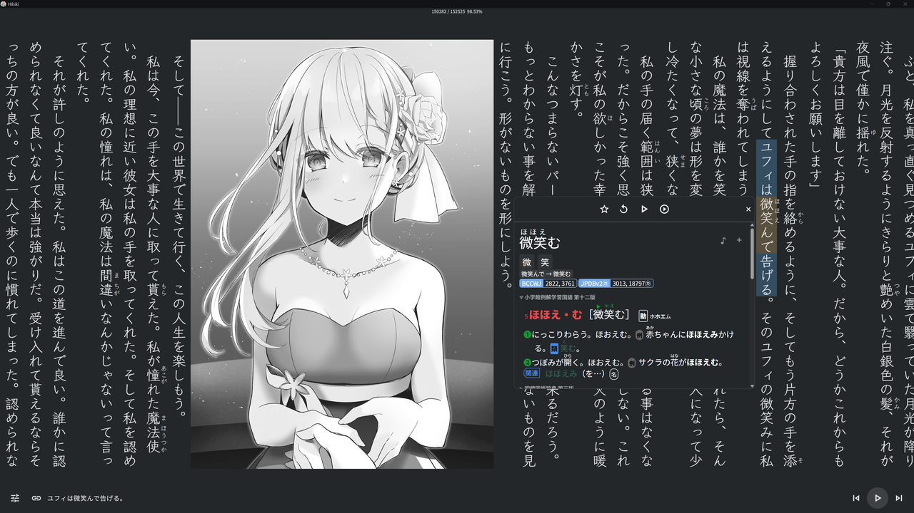
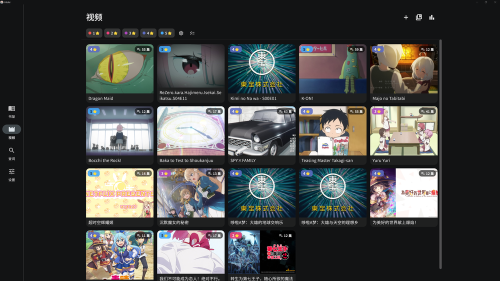
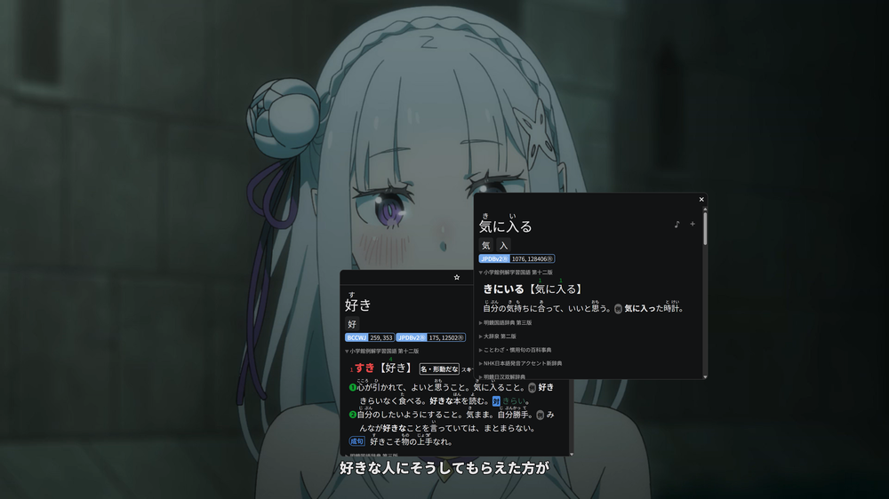

<h3 align="center">hibiki</h3>
<p align="center">
  
</p>

<p align="center"><b>读、听、看，把每一个生词变成可掌握的语言。</b></p>
<p align="center">多语言沉浸式语言学习工具 —— 读 · 听 · 看：EPUB 阅读 · 有声书同步 · 视频字幕查词 · 划词查词 · Anki 制卡</p>

<p align="center">
  
  
  &nbsp;·&nbsp;
  
  
</p>

<p align="center">
  <a href="https://hdjsadgfwtg.github.io/hibiki/"><b>📖 项目主页 (GitHub Pages)</b></a>
</p>

<p align="center">
  <a href="docs/readme/README.en.md">English</a> · <a href="docs/readme/README.ja.md">日本語</a> · <a href="docs/readme/README.ko.md">한국어</a> · <a href="docs/readme/README.es.md">Español</a> · <a href="docs/readme/README.fr.md">Français</a> · <a href="docs/readme/README.de.md">Deutsch</a> · <a href="docs/readme/README.pt-BR.md">Português</a> · <a href="docs/readme/README.ru.md">Русский</a> · <a href="docs/readme/README.it.md">Italiano</a> · <a href="docs/readme/README.nl.md">Nederlands</a> · <a href="docs/readme/README.tr.md">Türkçe</a> · <a href="docs/readme/README.vi.md">Tiếng Việt</a> · <a href="docs/readme/README.th.md">ภาษาไทย</a> · <a href="docs/readme/README.id.md">Bahasa Indonesia</a> · <a href="docs/readme/README.ar.md">العربية</a> · <a href="docs/readme/README.zh-Hant.md">繁體中文</a>
</p>

---

## 简介

**hibiki** 是一款多语言沉浸式语言学习工具，把「读 · 听 · 看」三种输入收进一套查词、制卡与同步流程：在 EPUB 正文里点按即查词、选词即分析，把生词一键做成 Anki 卡片；让有声书音频与正文逐句同步高亮、自动翻页；也能在视频字幕上直接查词制卡。一处查到的词，自动带上上下文进入复习。

词典查询覆盖 [Yomitan](https://github.com/yomidevs/yomitan) 的**全部变换语言**（去屈折 + 查词前文本归一化），界面本地化为 **17 种语言**，当前在 **Android 与 Windows** 两端出包。

<p align="center">
  
  &nbsp;
  
  &nbsp;
  
</p>
<p align="center"><sub>书架 · 查词 · 设置与主题</sub></p>

---

## 核心亮点

### 📖 EPUB 阅读，点按即查

WebView 渲染的 EPUB 阅读器，分页引擎衍生自 Hoshi Reader 系列（iOS 的 [Hoshi Reader](https://github.com/Manhhao/Hoshi-Reader) 与 Android 的 [Hoshi-Reader-Android](https://github.com/HuangAntimony/Hoshi-Reader-Android)）。点按任意词即时查词、选区即时分析。连续滚动与分页双模式，自定义字体与主题（明 / 暗 / 纯黑 / 自定义），振假名、阅读统计与书签一应俱全。

<p align="center">
  
</p>
<p align="center"><sub>竖排正文 · 振假名 · 划词高亮 · 底部有声书同步控制条</sub></p>

### 🔍 划词查词，覆盖 Yomitan 全部变换语言

导入 **Yomitan**（原 Yomichan）/ **ABBYY Lingvo (DSL)** / **MDict (MDX)** / **Migaku** 多种格式词典。多语言词形还原（Yomitan 变换表）+ 查词前文本归一化（大小写 / 变音符 / 阿拉伯 harakat），按码点驱动、无需切换语言。多词典并行查询、子来源优先级与启停、音调标注与词频，皆在一个弹窗里搞定。

<p align="center">
  
</p>
<p align="center"><sub>桌面竖排阅读（深色主题）· 划词查词弹窗 · 有声书插画与同步控制条</sub></p>

### 🎴 一键 Anki 制卡

查到生词，一步导出至 [AnkiDroid](https://github.com/ankidroid/Anki-Android) 与 AnkiConnect。内置 [Lapis](https://github.com/donkuri/lapis) 笔记类型 schema（vendored 1.7.0），可在 App 内直接创建卡片模板与牌组；自动填充上下文句子，支持录音与截图裁剪、多导出配置（Profile）、自定义字段映射，以及一键制卡。

### 🎧 有声书同步（Sasayaki）

支持 SRT / LRC / VTT / ASS 字幕，自动将字幕文本对齐到 EPUB 正文。播放时正文逐句高亮，音频与阅读位置同步翻页，并配合播放控制栏（进度、跳转、倍速）边听边读，让有声书的音频成为沉浸式输入的一部分。

### 🎬 视频字幕查词

内置基于 [media_kit](https://github.com/media-kit/media-kit)（libmpv 内核）的视频播放器，支持内嵌 / 外挂字幕。播放视频时**直接在字幕上查词、制卡**，把影视素材也纳入沉浸式输入；同时统计观看时长与制卡数量。

<p align="center">
  
</p>
<p align="center"><sub>视频画面 · 字幕条 · 右侧字幕列表 · 划词查词弹窗</sub></p>

<p align="center">
  
  &nbsp;
  
</p>
<p align="center"><sub>视频库 · 视频内嵌套查词（弹窗里再查词）</sub></p>

### 🔗 更多

- **17 种界面语言**，全平台本地化
- **Hibiki 互联**：设备间同步书籍 / 词典 / 有声书 / 阅读进度
- **多用户配置（Profile）**，按书自动切换
- **无痕模式**；从其他应用**分享文本直接查词**

---

## 平台支持

| 平台 | 状态 | 渲染 / UI |
|---|---|---|
| Android | ✅ | Material Design 3 |
| Windows | ✅ | Material（fork 的 `flutter_inappwebview_windows` 渲染 EPUB） |

> 最低 Android 7.0（API 24）。词典查词的语言由导入的词典与 Yomitan 变换表决定，与界面语言相互独立。

### 界面语言（17 种）

English · 简体中文 · 繁體中文 · 日本語 · 한국어 · Español · Français · Deutsch · Português (Brasil) · Русский · Tiếng Việt · ภาษาไทย · Bahasa Indonesia · Italiano · Nederlands · Türkçe · العربية

---

## 安装与构建

一键准备（`flutter pub get` + 打补丁），然后构建：

```bash
# 在仓库根目录
bash tool/bootstrap.sh          # Windows PowerShell：.\tool\bootstrap.ps1

cd hibiki
# Android
flutter build apk --release --target-platform android-arm64 --split-per-abi
# Windows 桌面
flutter build windows --release
```

`tool/bootstrap.sh` / `tool/bootstrap.ps1` 把 ①`flutter pub get` 与 ②`ci/apply-patches.sh` 收敛成一条命令。本项目锁定 Flutter 3.44.0（Dart SDK `>=3.5.0 <4.0.0`），部分上游依赖经 vendored 到 `third_party/` 或由 `ci/apply-patches.sh` 修补——机制细节、构建与依赖补丁清单见 [docs/agent/build.md](docs/agent/build.md)。

<details>
<summary><b>技术栈一览</b></summary>

| 层 | 技术 |
|---|---|
| 框架 | Flutter 3.44.0（Dart SDK `>=3.5.0 <4.0.0`） |
| 平台 | Android / Windows（Material Design 3） |
| 阅读器 | WebView 分页引擎（衍生自 Hoshi Reader 系列） |
| 视频 | media_kit（libmpv 内核） |
| 存储 | Drift（SQLite，WAL）+ hoshidicts（C++ FFI 词典引擎） |
| NLP | Yomitan 变换表（多语言词形还原）+ kana_kit（假名转换）；分词走 hoshidicts FFI |
| 制卡 | AnkiDroid API + AnkiConnect |
| 国际化 | Slang（17 种语言） |

</details>

<details>
<summary><b>项目结构</b></summary>

```
hibiki/                      # 仓库根（Melos workspace: hibiki_workspace）
├── hibiki/                  # Flutter 应用主目录
│   ├── lib/
│   │   ├── i18n/            # 国际化（17 种语言，Slang）
│   │   ├── src/
│   │   │   ├── pages/       # 页面（书架、阅读器、词典、设置等）
│   │   │   ├── reader/      # 阅读器 WebView JS/CSS 脚本
│   │   │   ├── media/       # 有声书、字幕解析、reader source
│   │   │   └── models/      # 数据模型与状态管理（AppModel）
│   │   └── main.dart
│   └── android/             # Android 工程（manifest、native hoshidicts）
├── packages/                # 内部 package + flutter_inappwebview_windows(fork) + gamepads_android_stub
├── native/                  # hoshidicts C++ 词典引擎（FFI）
├── third_party/             # vendored 补丁包（dependency_overrides 指向）
├── ci/                      # 构建补丁与集成测试脚本
├── tool/                    # bootstrap / i18n_sync 等脚本
└── docs/                    # 开发文档（含 docs/agent/ agent 操作手册）
```

</details>

---

## 致谢

| 项目 | 说明 |
|---|---|
| [jidoujisho](https://github.com/arianneorpilla/jidoujisho) | 日语沉浸式学习工具 |
| [Hoshi Reader Android](https://github.com/HuangAntimony/Hoshi-Reader-Android) | Android 日语阅读器 |
| [hoshidicts](https://github.com/Manhhao/hoshidicts) | C++ 词典引擎 |
| [Hoshi Reader](https://github.com/Manhhao/Hoshi-Reader) | iOS 日语阅读器 |
| [Sasayaki](https://github.com/Manhhao/Hoshi-Reader/blob/develop/SASAYAKI.md) | 有声书同步方案 |
| [Yomitan](https://github.com/yomidevs/yomitan) | 词典格式与变换表来源 |
| [Lapis](https://github.com/donkuri/lapis) | Anki 笔记类型 |

## 许可证

[GNU General Public License v3.0](LICENSE)

<p align="center">
  <a href="docs/readme/README.en.md">English</a> · <a href="docs/readme/README.ja.md">日本語</a> · <a href="docs/readme/README.ko.md">한국어</a> · <a href="docs/readme/README.es.md">Español</a> · <a href="docs/readme/README.fr.md">Français</a> · <a href="docs/readme/README.de.md">Deutsch</a> · <a href="docs/readme/README.pt-BR.md">Português</a> · <a href="docs/readme/README.ru.md">Русский</a> · <a href="docs/readme/README.it.md">Italiano</a> · <a href="docs/readme/README.nl.md">Nederlands</a> · <a href="docs/readme/README.tr.md">Türkçe</a> · <a href="docs/readme/README.vi.md">Tiếng Việt</a> · <a href="docs/readme/README.th.md">ภาษาไทย</a> · <a href="docs/readme/README.id.md">Bahasa Indonesia</a> · <a href="docs/readme/README.ar.md">العربية</a> · <a href="docs/readme/README.zh-Hant.md">繁體中文</a>
</p>
