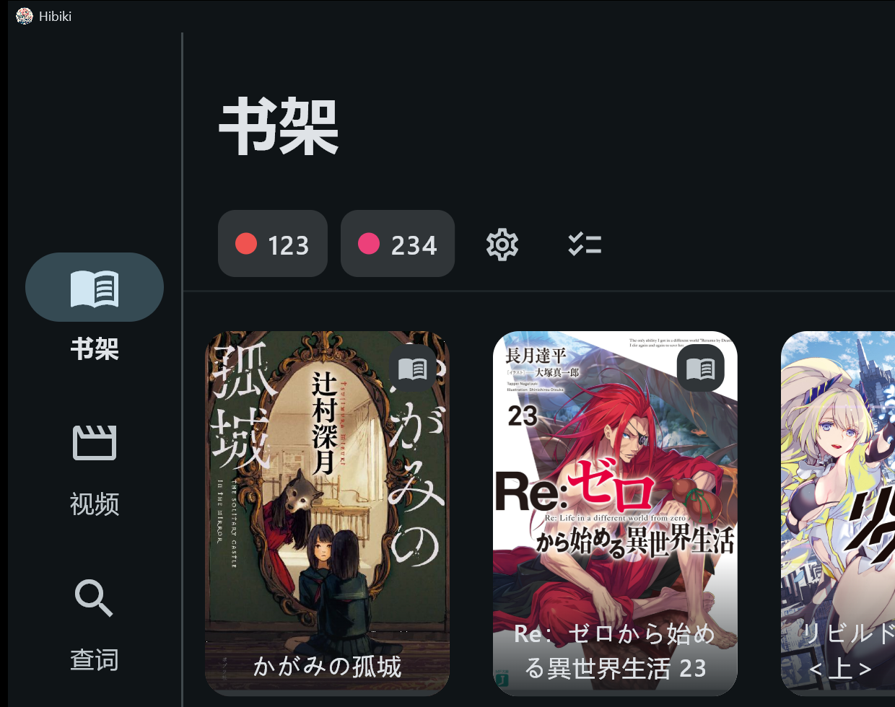
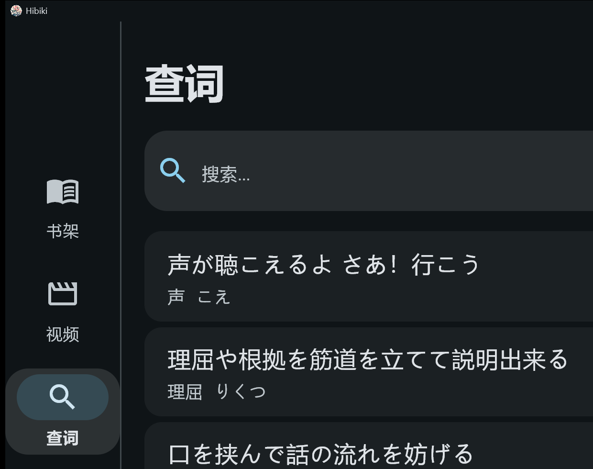
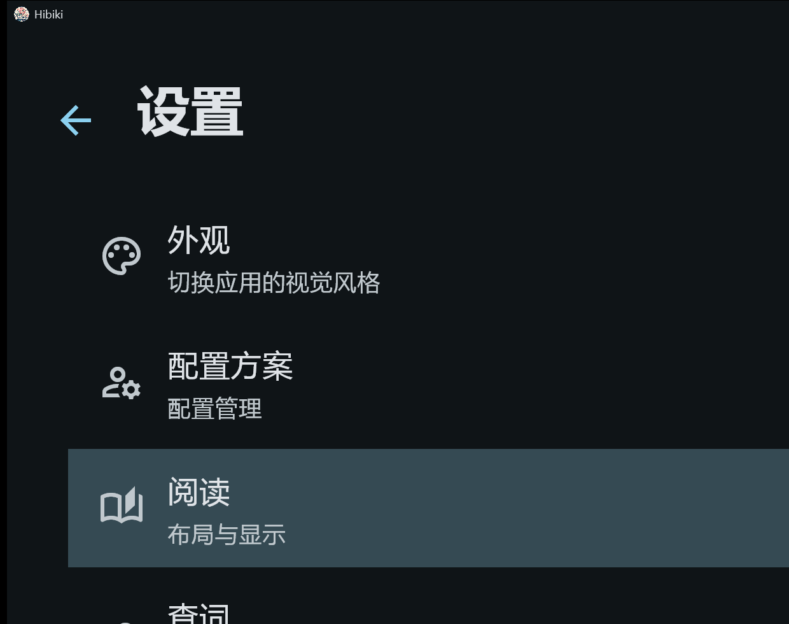
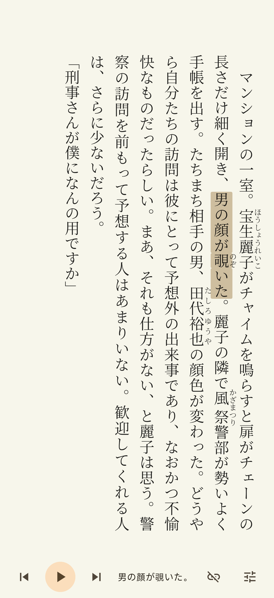

<h3 align="center">hibiki</h3>
<p align="center">
  
</p>

<p align="center"><b>Lies ein Buch und mach dir jedes unbekannte Wort zu eigen.</b></p>
<p align="center">Plattformübergreifender, mehrsprachiger immersiver Reader — EPUB-Lesen · Wörter per Auswahl nachschlagen · Anki-Karten erstellen · Hörbuch-Synchronisation · Wörter in Videountertiteln nachschlagen</p>

<p align="center">
  
  
  
  
  
  &nbsp;·&nbsp;
  
  
</p>

<p align="center">
  <a href="https://hdjsadgfwtg.github.io/hibiki/"><b>📖 Projekt-Homepage (GitHub Pages)</b></a>
</p>

<p align="center">
  <a href="../../README.md">简体中文</a> · <a href="README.en.md">English</a> · <a href="README.ja.md">日本語</a> · <a href="README.ko.md">한국어</a> · <a href="README.es.md">Español</a> · <a href="README.fr.md">Français</a> · <b>Deutsch</b> · <a href="README.pt-BR.md">Português</a> · <a href="README.ru.md">Русский</a> · <a href="README.it.md">Italiano</a> · <a href="README.nl.md">Nederlands</a> · <a href="README.tr.md">Türkçe</a> · <a href="README.vi.md">Tiếng Việt</a> · <a href="README.th.md">ภาษาไทย</a> · <a href="README.id.md">Bahasa Indonesia</a> · <a href="README.ar.md">العربية</a> · <a href="README.zh-Hant.md">繁體中文</a>
</p>

---

## Einführung

**hibiki** ist ein plattformübergreifender, immersiver Reader zum Sprachenlernen. Im EPUB-Text **antippen zum Nachschlagen, markieren zum Analysieren** – und ein unbekanntes Wort mit einem Klick in eine Anki-Karte verwandeln; Hörbuch-Audio satzweise synchron zum Text hervorheben; und sogar direkt in Videountertiteln Wörter nachschlagen und Karten erstellen. Ein Werkzeug für alle drei Formen immersiver Eingabe: „Lesen · Hören · Sehen".

Das Wörterbuch-Nachschlagen deckt **alle Transformationssprachen** von [Yomitan](https://github.com/yomidevs/yomitan) ab (Deflexion + Textnormalisierung vor dem Nachschlagen), die Oberfläche ist in **17 Sprachen** lokalisiert und die App unterstützt alle fünf Plattformen **Android / iOS / macOS / Windows / Linux**.

<p align="center">
  
  &nbsp;
  
  &nbsp;
  
</p>
<p align="center"><sub>Bibliothek · Nachschlagen · Einstellungen und Designs</sub></p>

---

## Highlights

### 📖 EPUB-Lesen, Nachschlagen per Antippen

In WebView gerenderter EPUB-Reader (Seitenumbruch-Engine abgeleitet von [Hoshi Reader](https://github.com/Manhhao/Hoshi-Reader)): Tippe ein beliebiges Wort an, um es sofort nachzuschlagen, markiere einen Bereich für die sofortige Analyse. Zwei Modi – Endlos-Scrollen und Seitenumbruch –, benutzerdefinierte Schriftarten und Designs (hell / dunkel / reines Schwarz / benutzerdefiniert), Furigana, Lesestatistiken und Lesezeichen sind alle dabei.

<p align="center">
  
</p>
<p align="center"><sub>Vertikaler Text · Furigana · Auswahl-Hervorhebung · Hörbuch-Synchronisationsleiste am unteren Rand</sub></p>

### 🔍 Nachschlagen per Auswahl, deckt alle Transformationssprachen von Yomitan ab

Importiere Wörterbücher in den Formaten **Yomitan** (ehemals Yomichan) / **ABBYY Lingvo (DSL)** / **MDict (MDX)** / **Migaku**. Mehrsprachige Lemmatisierung (Yomitan-Transformationstabellen) + Textnormalisierung vor dem Nachschlagen (Groß-/Kleinschreibung / Diakritika / arabische Harakat), codepunktgesteuert, ohne Sprachwechsel. Parallele Suche in mehreren Wörterbüchern, Priorität und Aktivierung/Deaktivierung von Unterquellen, Tonhöhenakzent-Markierung und Wortfrequenz – alles in einem einzigen Pop-up.

### 🎴 Anki-Karten mit einem Klick

Ist ein unbekanntes Wort gefunden, exportiere es in einem Schritt nach [AnkiDroid](https://github.com/ankidroid/Anki-Android) und AnkiConnect. Integriertes [Lapis](https://github.com/donkuri/lapis)-Notiztyp-Schema (vendort 1.7.0), mit dem sich Kartenvorlagen und Stapel direkt in der App erstellen lassen; automatisches Ausfüllen von Kontextsätzen, Unterstützung für Audioaufnahme und Screenshot-Zuschnitt, mehrere Exportprofile (Profile), benutzerdefinierte Feldzuordnung sowie Schnellaktionen zur Kartenerstellung in einem Schritt.

### 🎧 Hörbuch-Synchronisation (Sasayaki)

Unterstützung für SRT- / LRC- / VTT- / ASS-Untertitel mit automatischer Ausrichtung des Untertiteltextes am EPUB-Text. Bei der Wiedergabe **Mitlese-Hervorhebung und audiosynchroner Seitenwechsel**, ergänzt durch eine Wiedergabesteuerung (Fortschritt, Navigation, Geschwindigkeit): Beim Hören leuchtet der Text Satz für Satz auf – die Steuerleiste am unteren Rand des Lese-Screenshots oben auf dieser Seite zeigt genau diese Funktion.

### 🎬 Wörter in Videountertiteln nachschlagen

Integrierter Videoplayer auf Basis von media_kit / libmpv mit Unterstützung für eingebettete / externe Untertitel. Beim Abspielen eines Videos **direkt im Untertitel Wörter nachschlagen und Karten erstellen**, um auch Filmmaterial in die immersive Eingabe einzubeziehen; zudem werden Sehdauer und Anzahl der erstellten Karten erfasst.

<!-- TODO-782: 待补视频播放器截图 -->
<p align="center"><sub>📹 Videoplayer-Screenshot folgt</sub></p>

### 🔗 Mehr

- **17 Oberflächensprachen**, Lokalisierung auf allen Plattformen
- **Hibiki-Interconnect**: Synchronisation von Büchern / Wörterbüchern / Hörbüchern / Lesefortschritt zwischen Geräten
- **Mehrbenutzer-Profile (Profile)**, automatischer Wechsel je Buch
- **Inkognito-Modus**; **direktes Nachschlagen durch Teilen von Text** aus anderen Apps

---

## Plattformunterstützung

| Plattform | Status | Rendering / UI |
|---|---|---|
| Android | ✅ | Material Design 3 |
| iOS | ✅ | Cupertino |
| Windows | ✅ | Material (geforktes `flutter_inappwebview_windows` für EPUB-Rendering) |
| macOS | ✅ | Material |
| Linux | ✅ | Material |

> Mindestens Android 7.0 (API 24). Die Nachschlagesprache des Wörterbuchs ergibt sich aus den importierten Wörterbüchern und den Yomitan-Transformationstabellen, unabhängig von der Oberflächensprache.

### Oberflächensprachen (17)

English · 简体中文 · 繁體中文 · 日本語 · 한국어 · Español · Français · Deutsch · Português (Brasil) · Русский · Tiếng Việt · ภาษาไทย · Bahasa Indonesia · Italiano · Nederlands · Türkçe · العربية

---

## Installation und Kompilierung

Vorbereitung mit einem Befehl (`flutter pub get` + Patches anwenden), dann kompilieren:

```bash
# im Repository-Root
bash tool/bootstrap.sh          # Windows PowerShell: .\tool\bootstrap.ps1
                                # oder (Linux/macOS): dart run melos bootstrap

cd hibiki
flutter build apk --release --target-platform android-arm64 --split-per-abi
```

`tool/bootstrap.sh` / `tool/bootstrap.ps1` bündelt in einem Befehl ① `flutter pub get` und ② `ci/apply-patches.sh`. Das Projekt ist auf Flutter 3.44.0 festgelegt (Dart SDK `>=3.5.0 <4.0.0`); einige Upstream-Abhängigkeiten sind unter `third_party/` vendort oder werden von `ci/apply-patches.sh` gepatcht — Mechanismus-Details, Kompilierung auf allen fünf Plattformen sowie Abhängigkeits- und Patch-Liste siehe [docs/agent/build.md](../agent/build.md).

<details>
<summary><b>Technologie-Stack im Überblick</b></summary>

| Schicht | Technologie |
|---|---|
| Framework | Flutter 3.44.0 (Dart SDK `>=3.5.0 <4.0.0`) |
| Plattform | Android / iOS / macOS / Windows / Linux (Material 3 + Cupertino adaptiv) |
| Reader | WebView-Seitenumbruch-Engine (abgeleitet von [Hoshi Reader](https://github.com/Manhhao/Hoshi-Reader)) |
| Video | media_kit / libmpv |
| Speicher | Drift (SQLite, WAL) + hoshidicts (C++ FFI Wörterbuch-Engine) |
| NLP | Yomitan-Transformationstabellen (mehrsprachige Lemmatisierung) + kana_kit (Kana-Konvertierung); die Segmentierung läuft über hoshidicts FFI |
| Kartenerstellung | AnkiDroid API + AnkiConnect |
| Internationalisierung | Slang (17 Sprachen) |

</details>

<details>
<summary><b>Projektstruktur</b></summary>

```
hibiki/                      # Repository-Root (Melos-Workspace: hibiki_workspace)
├── hibiki/                  # Haupt-Flutter-App-Verzeichnis
│   ├── lib/
│   │   ├── i18n/            # Internationalisierung (17 Sprachen, Slang)
│   │   ├── src/
│   │   │   ├── pages/       # Seiten (Bibliothek, Reader, Wörterbuch, Einstellungen usw.)
│   │   │   ├── reader/      # Reader-WebView-JS/CSS-Skripte
│   │   │   ├── media/       # Hörbuch, Untertitel-Analyse, Reader-Source
│   │   │   └── models/      # Datenmodelle und Zustandsverwaltung (AppModel)
│   │   └── main.dart
│   └── android/             # Android-Projekt (Manifest, native hoshidicts)
├── packages/                # Interne Packages + flutter_inappwebview_windows(Fork) + gamepads_android_stub
├── native/                  # hoshidicts C++ Wörterbuch-Engine (FFI)
├── third_party/             # vendorte Patch-Pakete (von dependency_overrides referenziert)
├── ci/                      # Build-Patches und Integrationstest-Skripte
├── tool/                    # bootstrap / i18n_sync u. a. Skripte
└── docs/                    # Entwicklungsdokumentation (inkl. docs/agent/ Agent-Handbuch)
```

</details>

---

## Danksagungen

| Projekt | Beschreibung |
|---|---|
| [jidoujisho](https://github.com/arianneorpilla/jidoujisho) | Immersives Japanisch-Lerntool |
| [Hoshi Reader Android](https://github.com/HuangAntimony/Hoshi-Reader-Android) | Android-Japanisch-Reader |
| [hoshidicts](https://github.com/Manhhao/hoshidicts) | C++ Wörterbuch-Engine |
| [Hoshi Reader](https://github.com/Manhhao/Hoshi-Reader) | iOS-Japanisch-Reader |
| [Sasayaki](https://github.com/Manhhao/Hoshi-Reader/blob/develop/SASAYAKI.md) | Hörbuch-Synchronisationslösung |
| [Yomitan](https://github.com/yomidevs/yomitan) | Quelle für Wörterbuchformate und Transformationstabellen |
| [Lapis](https://github.com/donkuri/lapis) | Anki-Notiztyp |

## Lizenz

[GNU General Public License v3.0](../../LICENSE)

<p align="center">
  <a href="../../README.md">简体中文</a> · <a href="README.en.md">English</a> · <a href="README.ja.md">日本語</a> · <a href="README.ko.md">한국어</a> · <a href="README.es.md">Español</a> · <a href="README.fr.md">Français</a> · <b>Deutsch</b> · <a href="README.pt-BR.md">Português</a> · <a href="README.ru.md">Русский</a> · <a href="README.it.md">Italiano</a> · <a href="README.nl.md">Nederlands</a> · <a href="README.tr.md">Türkçe</a> · <a href="README.vi.md">Tiếng Việt</a> · <a href="README.th.md">ภาษาไทย</a> · <a href="README.id.md">Bahasa Indonesia</a> · <a href="README.ar.md">العربية</a> · <a href="README.zh-Hant.md">繁體中文</a>
</p>
