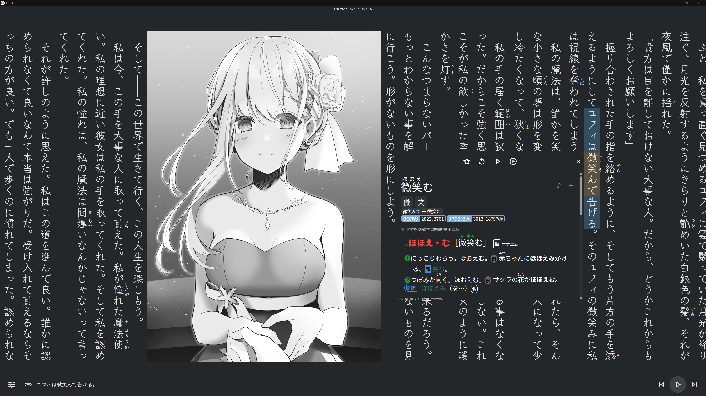
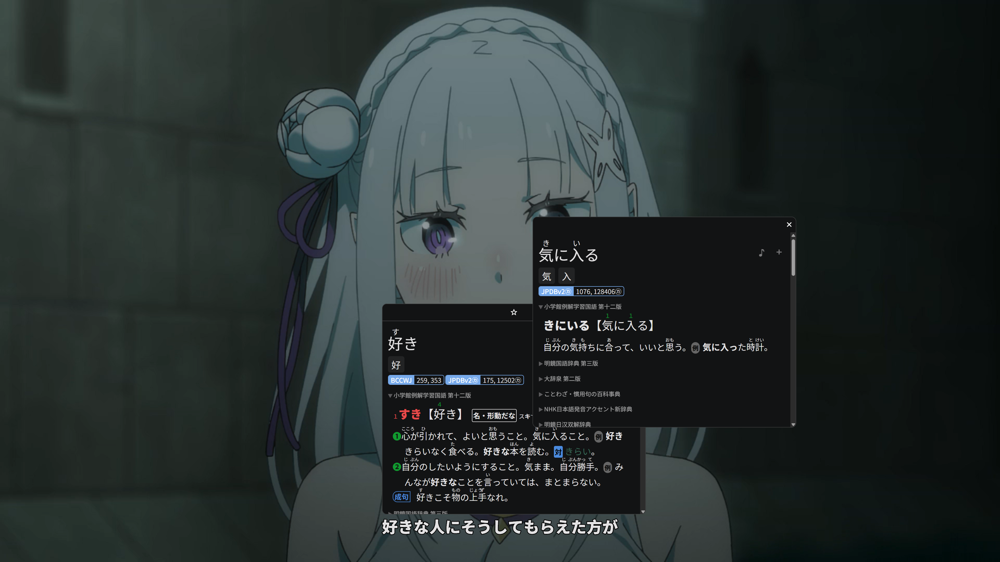

<div align="center">

# hibiki


[简体中文](../../README.md) | [English](README.en.md) | [繁體中文](README.zh-Hant.md) | [日本語](README.ja.md) | [한국어](README.ko.md) | **Español** | [Français](README.fr.md) | [Deutsch](README.de.md) | [Português](README.pt-BR.md) | [Русский](README.ru.md) | [Tiếng Việt](README.vi.md) | [ภาษาไทย](README.th.md) | [Bahasa Indonesia](README.id.md) | [Italiano](README.it.md) | [Nederlands](README.nl.md) | [Türkçe](README.tr.md) | [العربية](README.ar.md)

[Guía de usuario](../user-guide.es.md) | [Descargar la última versión](https://github.com/hajisensai/hibiki/releases)

hibiki es una herramienta inmersiva de aprendizaje de idiomas para Android y Windows que reúne la lectura de EPUB, la sincronización de audiolibros, la búsqueda de palabras en subtítulos de vídeo y la creación de tarjetas Anki con un solo toque, para que cada entrada se convierta de forma natural en vocabulario repasable.

<table>
  <tr>
    <td></td>
    <td></td>
  </tr>
  <tr>
    <td colspan="2"></td>
  </tr>
  <tr>
    <td></td>
    <td></td>
  </tr>
</table>

</div>

## Características

### Estantería

- Importa EPUB de forma individual, en lote o de manera recursiva por carpeta; consulta el progreso de lectura en la estantería.
- Organiza los libros con estanterías personalizadas, filtrado por etiquetas y reordenación arrastrando.
- Arrastra y suelta archivos para importar libros, subtítulos o vídeos (escritorio).
- Asocia automáticamente los archivos de subtítulos / audio con el mismo nombre al importar.

### Lectura

- Lee en disposición vertical u horizontal; alterna entre los modos paginado y desplazamiento continuo.
- Personaliza temas (claro / oscuro / negro puro / personalizado), fuentes, espaciado de párrafos y controles del lector.
- Anotaciones furigana (ふりがな).
- Escala de interfaz ajustable; los controles de la barra inferior siguen la escala.
- Perfiles multiusuario (Profile), que se cambian automáticamente según el libro.

### Búsqueda

- Importa diccionarios [Yomitan](https://github.com/yomidevs/yomitan) (antes Yomichan), ABBYY Lingvo (DSL), MDict (MDX) y Migaku.
- Toca el texto en el lector para buscar palabras, busca en la página de diccionario o comparte texto desde otras aplicaciones.
- Desinflexión que cubre **todos los idiomas de transformación de Yomitan** + normalización del texto previa a la búsqueda (mayúsculas/minúsculas / diacríticos / harakat árabe), guiada por puntos de código sin cambio de idioma.
- Toca las palabras dentro de las definiciones para una búsqueda recursiva (ventanas emergentes anidadas).
- Consultas paralelas en varios diccionarios, prioridad y activación de subfuentes, anotaciones de acento tonal y frecuencia.
- Audio de palabras en línea y local.
- Inyecta CSS personalizado.

### Resaltados y estadísticas

- Añade resaltados de cinco colores mientras lees; salta a cualquier resaltado en cualquier momento.
- Estadísticas de lectura: caracteres leídos, duración, velocidad de lectura, mostradas en tiempo real durante la lectura.
- Estadísticas de vídeo: tiempo de visionado, tarjetas creadas y favoritos.

### Creación de tarjetas Anki

- Crea tarjetas mediante [AnkiDroid](https://github.com/ankidroid/Anki-Android) o AnkiConnect.
- Tipo de nota [Lapis](https://github.com/donkuri/lapis) integrado (incluido 1.7.0); crea plantillas de tarjetas y mazos dentro de la aplicación con un solo toque.
- Autocompleta frases de contexto; grabación de audio y recorte de capturas de pantalla.
- Varios perfiles de exportación (Profile) y asignación de campos personalizada.
- Palabras favoritas; las tarjetas creadas y los favoritos se contabilizan en las estadísticas.

### Sincronización de audiolibros (Sasayaki)

- Compatibilidad con subtítulos SRT / LRC / VTT / ASS; alinea automáticamente el texto de los subtítulos con el cuerpo del EPUB.
- Resaltado de frases con seguimiento y paso de página automático durante la reproducción.
- Velocidad de reproducción, acciones de búsqueda y controles multimedia del sistema.
- «Reproducir desde esta frase» con continuación fluida entre capítulos.

### Búsqueda en subtítulos de vídeo

- Reproductor de vídeo integrado basado en [media_kit](https://github.com/media-kit/media-kit) (núcleo libmpv).
- Subtítulos incrustados (pistas de texto + gráficas) y externos; importación de listas de reproducción .m3u8.
- Busca palabras y crea tarjetas directamente desde los subtítulos durante la reproducción.
- Gestión de la biblioteca de vídeos, filtrado por etiquetas, agrupación en series y operaciones por lotes.

### Sincronización de datos

- Siete backends de sincronización: Google Drive, OneDrive, Dropbox, WebDAV, FTP, SFTP y Hibiki P2P.
- Sincroniza el progreso de lectura, las estadísticas y los libros.

### Más

- **17 idiomas de interfaz**, totalmente localizados en todas las plataformas.
- Comparte texto desde otras aplicaciones para buscar palabras directamente.

## Compatibilidad de plataformas

| Plataforma | Estado | Renderizado / Interfaz |
|---|---|---|
| Android | ✅ | Material Design 3 |
| Windows | ✅ | Material |

> Mínimo Android 7.0 (API 24). Los idiomas disponibles para la búsqueda en diccionarios los determinan los diccionarios importados y las tablas de transformación de Yomitan, con independencia del idioma de la interfaz.

### Idiomas de interfaz (17)

English · 简体中文 · 繁體中文 · 日本語 · 한국어 · Español · Français · Deutsch · Português (Brasil) · Русский · Tiếng Việt · ภาษาไทย · Bahasa Indonesia · Italiano · Nederlands · Türkçe · العربية

## Instalación y compilación

Preparación con un solo comando (`flutter pub get` + aplicar parches), luego compila:

```bash
# Desde la raíz del repositorio
bash tool/bootstrap.sh          # Windows PowerShell: .\tool\bootstrap.ps1

cd hibiki
# Android
flutter build apk --release --target-platform android-arm64 --split-per-abi
# Escritorio Windows
flutter build windows --release
```

`tool/bootstrap.sh` / `tool/bootstrap.ps1` agrupan `flutter pub get` y `ci/apply-patches.sh` en un único comando. Este proyecto está fijado a Flutter 3.44.0 (Dart SDK `>=3.5.0 <4.0.0`); algunas dependencias upstream están incluidas en `third_party/` o parcheadas por `ci/apply-patches.sh`; consulta [docs/agent/build.md](../agent/build.md) para más detalles.

<details>
<summary><b>Pila tecnológica</b></summary>

| Capa | Tecnología |
|---|---|
| Framework | Flutter 3.44.0 (Dart SDK `>=3.5.0 <4.0.0`) |
| Plataformas | Android / Windows (Material Design 3) |
| Lector | Motor de paginación WebView (derivado de la familia Hoshi Reader) |
| Vídeo | media_kit (libmpv core) |
| Almacenamiento | Drift (SQLite, WAL) + hoshidicts (motor de diccionarios FFI en C++) |
| PLN | Tablas de transformación de Yomitan (lematización multilingüe) + kana_kit (conversión de kana); tokenización mediante hoshidicts FFI |
| Creación de tarjetas | AnkiDroid API + AnkiConnect |
| i18n | Slang (17 idiomas) |

</details>

<details>
<summary><b>Estructura del proyecto</b></summary>

```
hibiki/                      # Raíz del repositorio (espacio de trabajo Melos: hibiki_workspace)
├── hibiki/                  # Directorio principal de la aplicación Flutter
│   ├── lib/
│   │   ├── i18n/            # Internacionalización (17 idiomas, Slang)
│   │   ├── src/
│   │   │   ├── pages/       # Páginas (estantería, lector, diccionario, ajustes, etc.)
│   │   │   ├── reader/      # Scripts JS/CSS del WebView del lector
│   │   │   ├── media/       # Audiolibros, análisis de subtítulos, fuente del lector
│   │   │   └── models/      # Modelos de datos y gestión de estado (AppModel)
│   │   └── main.dart
│   └── android/             # Proyecto Android (manifest, hoshidicts nativo)
├── packages/                # Paquetes internos + flutter_inappwebview_windows (fork) + gamepads_android_stub
├── native/                  # Motor de diccionarios en C++ hoshidicts (FFI)
├── third_party/             # Paquetes parcheados incluidos (dependency_overrides)
├── ci/                      # Parches de compilación y scripts de pruebas de integración
├── tool/                    # Scripts bootstrap / i18n_sync y otros
└── docs/                    # Documentación de desarrollo (incl. manual de operaciones docs/agent/)
```

</details>

## Privacidad y datos

hibiki almacena los libros importados, diccionarios, fuentes, datos de audiolibros, vídeos, progreso de lectura, resaltados, estadísticas y ajustes en el almacenamiento local de la aplicación.

La sincronización en la nube (Google Drive / OneDrive / Dropbox) utiliza credenciales OAuth configuradas por el usuario; WebDAV / FTP / SFTP usa direcciones de servidor y credenciales proporcionadas por el usuario; Hibiki P2P se conecta directamente mediante una dirección configurada por el usuario. La creación de tarjetas Anki se comunica con AnkiDroid o con una dirección de AnkiConnect configurada.

## Agradecimientos

hibiki se apoya en los siguientes proyectos y ecosistema:

| Proyecto | Descripción |
|---|---|
| [jidoujisho](https://github.com/arianneorpilla/jidoujisho) | Herramienta de aprendizaje inmersivo de japonés |
| [Hoshi Reader](https://github.com/Manhhao/Hoshi-Reader) | Lector de japonés para iOS; referencia del motor de paginación del lector |
| [Hoshi Reader Android](https://github.com/HuangAntimony/Hoshi-Reader-Android) | Lector de japonés nativo para Android |
| [hoshidicts](https://github.com/Manhhao/hoshidicts) | Motor de diccionarios en C++ |
| [Sasayaki](https://github.com/Manhhao/Hoshi-Reader/blob/develop/SASAYAKI.md) | Solución de sincronización de audiolibros |
| [Yomitan](https://github.com/yomidevs/yomitan) | Referencia de formato de diccionario, tablas de transformación y experiencia de búsqueda |
| [Lapis](https://github.com/donkuri/lapis) | Tipo de nota de Anki |
| [AnkiDroid](https://github.com/ankidroid/Anki-Android) | Integración de creación de tarjetas en Android |
| [Ankiconnect Android](https://github.com/KamWithK/AnkiconnectAndroid) | Referencia de audio local e interacción con AnkiDroid |
| [ッツ Ebook Reader](https://github.com/ttu-ttu/ebook-reader) | Referencia de compatibilidad de lector, estadísticas y sincronización |
| [media_kit](https://github.com/media-kit/media-kit) | Framework de reproducción de vídeo de Flutter (núcleo libmpv) |

## Licencia

Distribuido bajo la Licencia Pública General de GNU v3.0. Consulta [LICENSE](../../LICENSE) para más detalles.

<div align="center">

<br>

[简体中文](../../README.md) | [English](README.en.md) | [繁體中文](README.zh-Hant.md) | [日本語](README.ja.md) | [한국어](README.ko.md) | **Español** | [Français](README.fr.md) | [Deutsch](README.de.md) | [Português](README.pt-BR.md) | [Русский](README.ru.md) | [Tiếng Việt](README.vi.md) | [ภาษาไทย](README.th.md) | [Bahasa Indonesia](README.id.md) | [Italiano](README.it.md) | [Nederlands](README.nl.md) | [Türkçe](README.tr.md) | [العربية](README.ar.md)

</div>
