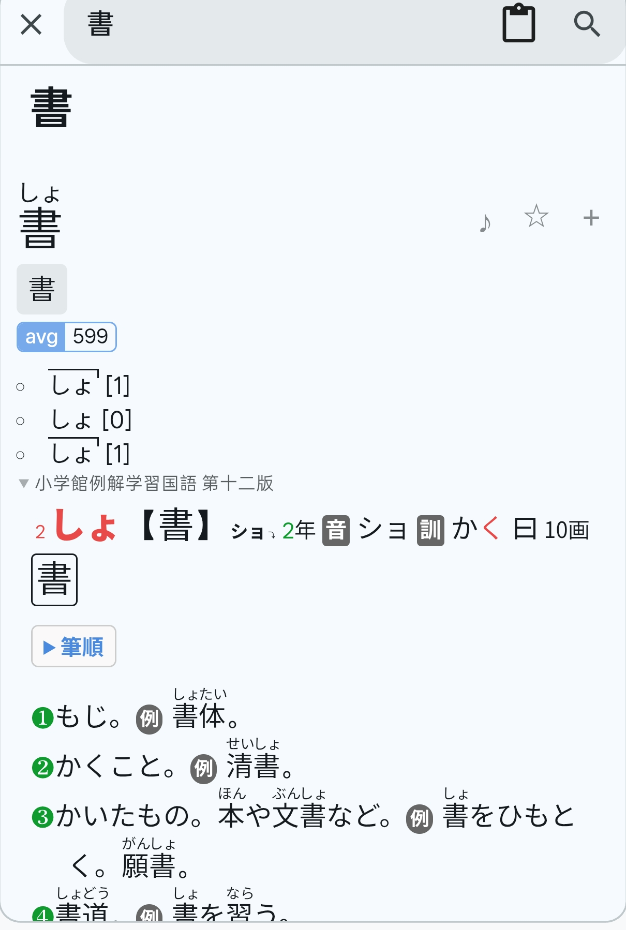
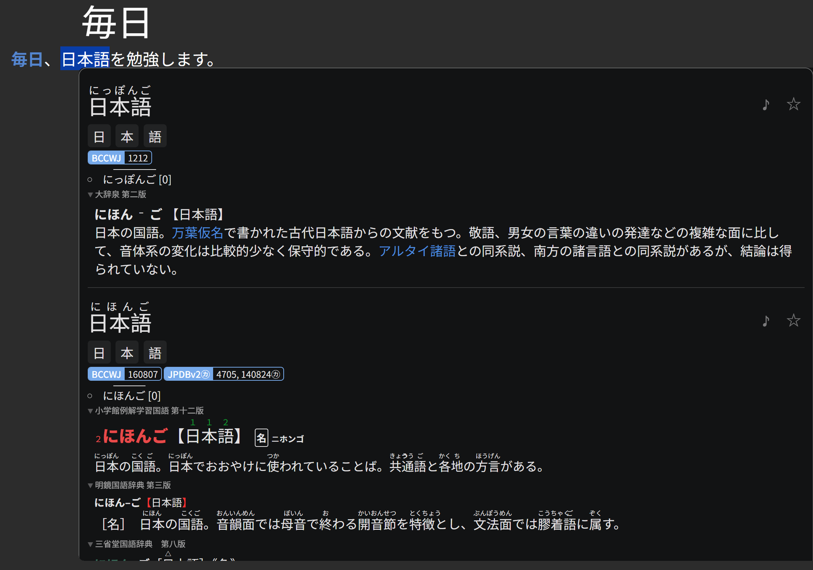

<div align="center">

# hibiki


[简体中文](../../README.md) | [English](README.en.md) | [繁體中文](README.zh-Hant.md) | [日本語](README.ja.md) | [한국어](README.ko.md) | [Español](README.es.md) | [Français](README.fr.md) | [Deutsch](README.de.md) | [Português](README.pt-BR.md) | **Русский** | [Tiếng Việt](README.vi.md) | [ภาษาไทย](README.th.md) | [Bahasa Indonesia](README.id.md) | [Italiano](README.it.md) | [Nederlands](README.nl.md) | [Türkçe](README.tr.md) | [العربية](README.ar.md)

[Руководство пользователя](../user-guide.ru.md) | [Скачать последнюю версию](https://github.com/hajisensai/hibiki/releases)

> **Смотрите то, что хочется, — и язык подтянется сам собой.**

hibiki превращает романы, которые вы читаете, сериалы, за которыми следите, и аудиокниги, которые слушаете, в ваш языковой ввод: нажмите на любое незнакомое слово, чтобы найти его, и одним нажатием превратите в карточку Anki с исходным контекстом. Он не заставляет зубрить заранее составленный список слов, а лишь помогает уловить слова, которые вы **действительно читаете и слышите**.

Самый эффективный способ выучить язык — это обильное погружение в настоящий контент, а не заучивание изолированных слов из словарика. Но у «погружения» всегда было два неудобства: поиск слова сбивает поток, а стоит отвести взгляд — и слово забыто. hibiki замыкает этот круг:

📖 **Чтение**: нажмите на слово в EPUB-читалке, чтобы найти его, не покидая текущую страницу.<br>
🎧 **Прослушивание**: аудиокниги подсвечивают текст фраза за фразой и автоматически перелистывают страницы.<br>
🎬 **Просмотр**: ищите слова и создавайте карточки прямо в субтитрах видео — следить за сериалом *и есть* ввод.<br>
🃏 **Закрепление**: отправляйте в Anki любое найденное слово из любого сценария и повторяйте только те слова, что вам действительно встретились.

Все сценарии используют одни и те же словари, статистику и процесс повторения. Подходит для любого языка (японский, английский, …) и особенно — для тех, кто учится погружением и верит в принцип **много ввода + только собственные карточки**. Доступно для Android и Windows (iOS и macOS в планах).

<table>
  <tr>
    <td></td>
    <td></td>
  </tr>
  <tr>
    <td colspan="2"></td>
  </tr>
  <tr>
    <td></td>
    <td></td>
  </tr>
  <tr>
    <td></td>
    <td></td>
  </tr>
</table>

**Демонстрация создания карточек Anki в одно нажатие**

<video src="https://github.com/hajisensai/hibiki/raw/main/docs/static-assets/screenshots/hibiki-readme-anki-mining-demo.mp4" controls muted width="100%"></video>

> Видео не отображается? [Посмотреть демо создания карточек в один клик ▶](https://github.com/hajisensai/hibiki/raw/main/docs/static-assets/screenshots/hibiki-readme-anki-mining-demo.mp4)

</div>

## Возможности

### Книжная полка

- Импорт EPUB поштучно, пакетно или рекурсивно по папкам; просмотр прогресса чтения прямо на полке.
- Организация книг с помощью пользовательских полок, фильтрации по тегам и перетаскивания для упорядочивания.
- Перетаскивание файлов для импорта книг, субтитров или видео (десктоп).
- Автоматическое связывание одноимённых файлов субтитров / аудио при импорте.

### Чтение

- Чтение в вертикальной или горизонтальной раскладке; переключение между постраничным режимом и непрерывной прокруткой.
- Настройка тем (светлая / тёмная / чисто-чёрная / пользовательская), шрифтов, межабзацного интервала и элементов управления читалки.
- Аннотации фуригана (ふりがな).
- Регулируемый масштаб интерфейса; элементы нижней панели следуют за масштабом.
- Несколько пользовательских профилей (Profile) с автоматическим переключением для каждой книги.

### Поиск слов

- Импорт словарей [Yomitan](https://github.com/yomidevs/yomitan) (ранее Yomichan), ABBYY Lingvo (DSL), MDict (MDX) и Migaku.
- Нажмите на текст в читалке для поиска слов, ищите на странице словаря или передавайте текст из других приложений.
- Деинфлексия, охватывающая **все языки трансформации Yomitan**, + нормализация текста перед поиском (регистр / диакритика / арабская харакат), управляемая по кодовым точкам без переключения языка.
- Нажатие на слова внутри определений для рекурсивного поиска (вложенные всплывающие окна).
- Параллельный поиск по нескольким словарям, приоритет и включение/отключение подысточников, аннотации тонального ударения и частотности.
- Онлайн- и локальное аудио слов.
- Внедрение пользовательского CSS.

### Подсветки и статистика

- Добавление пятицветных подсветок во время чтения; переход к любой подсветке в любой момент.
- Статистика чтения: прочитанные символы, длительность, скорость чтения — отображается в реальном времени во время чтения.
- Статистика видео: время просмотра, созданные карточки и избранное.

### Создание карточек Anki

- Создание карточек через [AnkiDroid](https://github.com/ankidroid/Anki-Android) или AnkiConnect.
- Встроенный тип заметки [Lapis](https://github.com/donkuri/lapis) (vendored 1.7.0); создание шаблонов карточек и колод прямо в приложении одним нажатием.
- Автозаполнение контекстных предложений; запись аудио и обрезка скриншотов.
- Несколько профилей экспорта (Profile) и настраиваемое сопоставление полей.
- Избранные слова; созданные карточки и избранное учитываются в статистике.

### Синхронизация аудиокниг (Sasayaki)

- Поддержка субтитров SRT / LRC / VTT / ASS; автоматическое выравнивание текста субтитров по тексту EPUB.
- Подсветка предложений вслед за чтением и автоматический переход страниц во время воспроизведения.
- Скорость воспроизведения, действия навигации и системные элементы управления медиа.
- «Воспроизвести с этого предложения» с бесшовным продолжением между главами.

### Поиск слов в субтитрах видео

- Встроенный видеоплеер на основе [media_kit](https://github.com/media-kit/media-kit) (ядро libmpv).
- Встроенные (текстовые + графические дорожки) и внешние субтитры; импорт плейлистов .m3u8.
- Поиск слов и создание карточек прямо из субтитров во время воспроизведения.
- Управление видеотекой, фильтрация по тегам, группировка по сериям и пакетные операции.

### Синхронизация данных

- Семь бэкендов синхронизации: Google Drive, OneDrive, Dropbox, WebDAV, FTP, SFTP и Hibiki P2P.
- Синхронизация прогресса чтения, статистики и книг.

### Ещё

- **17 языков интерфейса**, полностью локализованы на всех платформах.
- Передача текста из других приложений для прямого поиска слов.

## Поддержка платформ

| Платформа | Статус | Рендеринг / UI |
|---|---|---|
| Android | ✅ | Material Design 3 |
| Windows | ✅ | Material |

> Минимум Android 7.0 (API 24). Языки, доступные для поиска по словарю, определяются импортированными словарями и таблицами трансформации Yomitan, независимо от языка интерфейса.

### Языки интерфейса (17)

English · 简体中文 · 繁體中文 · 日本語 · 한국어 · Español · Français · Deutsch · Português (Brasil) · Русский · Tiếng Việt · ภาษาไทย · Bahasa Indonesia · Italiano · Nederlands · Türkçe · العربية

## Установка и сборка

Подготовка одной командой (`flutter pub get` + применение патчей), затем сборка:

```bash
# из корня репозитория
bash tool/bootstrap.sh          # Windows PowerShell: .\tool\bootstrap.ps1

cd hibiki
# Android
flutter build apk --release --target-platform android-arm64 --split-per-abi
# Windows desktop
flutter build windows --release
```

`tool/bootstrap.sh` / `tool/bootstrap.ps1` сводят `flutter pub get` и `ci/apply-patches.sh` в одну команду. Проект привязан к Flutter 3.44.0 (Dart SDK `>=3.5.0 <4.0.0`); часть upstream-зависимостей vendored в `third_party/` или патчится через `ci/apply-patches.sh` — подробности см. в [docs/agent/build.md](../agent/build.md).

<details>
<summary><b>Технологический стек</b></summary>

| Уровень | Технология |
|---|---|
| Фреймворк | Flutter 3.44.0 (Dart SDK `>=3.5.0 <4.0.0`) |
| Платформы | Android / Windows (Material Design 3) |
| Читалка | Постраничный движок на WebView (на основе семейства Hoshi Reader) |
| Видео | media_kit (ядро libmpv) |
| Хранение | Drift (SQLite, WAL) + hoshidicts (движок словарей C++ FFI) |
| NLP | Таблицы трансформации Yomitan (многоязычная лемматизация) + kana_kit (конвертация кана); сегментация через hoshidicts FFI |
| Создание карточек | AnkiDroid API + AnkiConnect |
| i18n | Slang (17 языков) |

</details>

<details>
<summary><b>Структура проекта</b></summary>

```
hibiki/                      # Корень репозитория (Melos workspace: hibiki_workspace)
├── hibiki/                  # Основной каталог Flutter-приложения
│   ├── lib/
│   │   ├── i18n/            # Интернационализация (17 языков, Slang)
│   │   ├── src/
│   │   │   ├── pages/       # Страницы (книжная полка, читалка, словарь, настройки и др.)
│   │   │   ├── reader/      # JS/CSS-скрипты WebView читалки
│   │   │   ├── media/       # Аудиокниги, разбор субтитров, reader source
│   │   │   └── models/      # Модели данных и управление состоянием (AppModel)
│   │   └── main.dart
│   └── android/             # Android-проект (manifest, native hoshidicts)
├── packages/                # Внутренние пакеты + flutter_inappwebview_windows (fork) + gamepads_android_stub
├── native/                  # Движок словарей C++ hoshidicts (FFI)
├── third_party/             # Vendored патч-пакеты (dependency_overrides)
├── ci/                      # Патчи сборки и скрипты интеграционных тестов
├── tool/                    # Скрипты bootstrap / i18n_sync и др.
└── docs/                    # Документация разработки (включая руководство по операциям docs/agent/)
```

</details>

## Конфиденциальность и данные

hibiki хранит импортированные книги, словари, шрифты, данные аудиокниг, видео, прогресс чтения, подсветки, статистику и настройки в локальном хранилище приложения.

Облачная синхронизация (Google Drive / OneDrive / Dropbox) использует настроенные пользователем учётные данные OAuth; WebDAV / FTP / SFTP использует предоставленные пользователем адреса серверов и учётные данные; Hibiki P2P подключается напрямую по настроенному пользователем адресу. Создание карточек Anki взаимодействует с AnkiDroid или настроенным адресом AnkiConnect.

## Благодарности

hibiki опирается на следующие проекты и экосистему:

| Проект | Описание |
|---|---|
| [jidoujisho](https://github.com/arianneorpilla/jidoujisho) | Инструмент иммерсивного изучения японского |
| [Hoshi Reader](https://github.com/Manhhao/Hoshi-Reader) | Читалка японского для iOS; референс постраничного движка |
| [Hoshi Reader Android](https://github.com/HuangAntimony/Hoshi-Reader-Android) | Нативная читалка японского для Android |
| [hoshidicts](https://github.com/Manhhao/hoshidicts) | Движок словарей C++ |
| [Sasayaki](https://github.com/Manhhao/Hoshi-Reader/blob/develop/SASAYAKI.md) | Решение для синхронизации аудиокниг |
| [Yomitan](https://github.com/yomidevs/yomitan) | Референс формата словарей, таблиц трансформации и опыта поиска |
| [Lapis](https://github.com/donkuri/lapis) | Тип заметки Anki |
| [AnkiDroid](https://github.com/ankidroid/Anki-Android) | Интеграция создания карточек на Android |
| [Ankiconnect Android](https://github.com/KamWithK/AnkiconnectAndroid) | Референс локального аудио и взаимодействия с AnkiDroid |
| [ッツ Ebook Reader](https://github.com/ttu-ttu/ebook-reader) | Референс совместимости читалки, статистики и синхронизации |
| [media_kit](https://github.com/media-kit/media-kit) | Фреймворк воспроизведения видео для Flutter (ядро libmpv) |

## Лицензия

Распространяется под лицензией GNU General Public License v3.0. Подробности см. в [LICENSE](../../LICENSE).

<div align="center">

<br>

[简体中文](../../README.md) | [English](README.en.md) | [繁體中文](README.zh-Hant.md) | [日本語](README.ja.md) | [한국어](README.ko.md) | [Español](README.es.md) | [Français](README.fr.md) | [Deutsch](README.de.md) | [Português](README.pt-BR.md) | **Русский** | [Tiếng Việt](README.vi.md) | [ภาษาไทย](README.th.md) | [Bahasa Indonesia](README.id.md) | [Italiano](README.it.md) | [Nederlands](README.nl.md) | [Türkçe](README.tr.md) | [العربية](README.ar.md)

</div>
