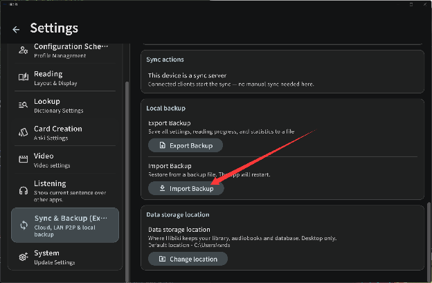
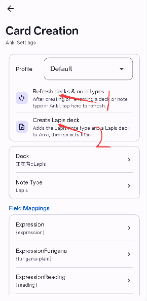
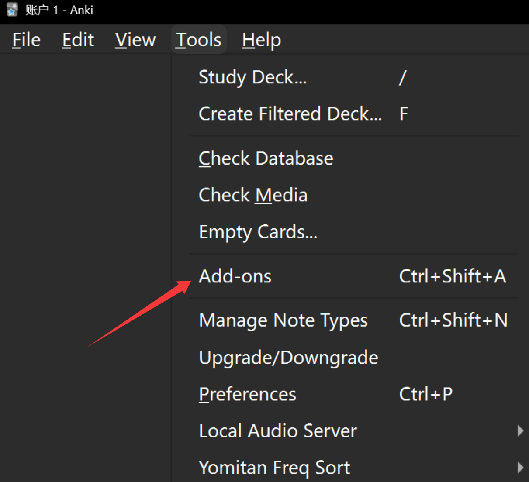
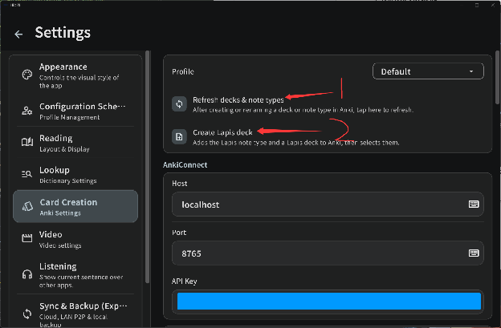

# hibiki User Guide

**English** | [简体中文](https://ncnies6wfjok.feishu.cn/wiki/OZbww3T3IiEAx5kBhHkcF07vncb) | [繁體中文](user-guide.zh-Hant.md) | [日本語](user-guide.ja.md) | [한국어](user-guide.ko.md) | [Español](user-guide.es.md) | [Français](user-guide.fr.md) | [Deutsch](user-guide.de.md) | [Português](user-guide.pt-BR.md) | [Русский](user-guide.ru.md) | [Tiếng Việt](user-guide.vi.md) | [ภาษาไทย](user-guide.th.md) | [Bahasa Indonesia](user-guide.id.md) | [Italiano](user-guide.it.md) | [Nederlands](user-guide.nl.md) | [Türkçe](user-guide.tr.md) | [العربية](user-guide.ar.md)

> The Simplified Chinese guide is hosted on Feishu (link above). The English guide is also available [on GitHub](https://github.com/hajisensai/hibiki/blob/main/docs/user-guide.md).

## Introduction

This is free software for Android / Windows (iOS / macOS planned) -- an epoch-making, multi-platform open-source app that combines novel reading, audiobook playback, video playback, and dictionary lookup.

### Project URL

https://github.com/hajisensai/hibiki

Actively developed — Your feedback will be addressed promptly. Bug reports and feature requests are welcome. If you find Hibiki useful, sharing it with others or leaving a ⭐ on the repository is appreciated.

### Download

https://github.com/hajisensai/hibiki/releases/latest

Android: choose **arm64**. Windows: choose the **.exe** file.

## Configuration Tutorial

### 1. Import recommended dictionaries and local audio (optional)

[OneDrive](https://zfile.kanochi.cn/dl/Public/%E6%9D%82%E9%A1%B9/hibiki-backup-2026-06-29.hibiki.zip) / [Google Drive](https://drive.google.com/file/d/1JYzv6dXB5sDPQBxttFLJzlmN3XTTo79S/view?usp=sharing)

In the app: Settings -> Sync & Backup -> tap **Import Backup**.

**Note: Importing a backup will clear local data. This flow will be improved in a future update.**

### 2. Download and configure Anki from the official Anki website

Anki -- named after 暗記 (あんき) -- is the world's most widely used [Spaced Repetition System (SRS)](https://en.wikipedia.org/wiki/Spaced_repetition), and a very important tool.

Links: [Anki official site](https://apps.ankiweb.net/) · [Manual (Chinese)](https://open-spaced-repetition.github.io/anki-manual-zh-CN/) · [FAQ](https://eaa9gdwuyv7.feishu.cn/wiki/YeOSwsG7giLuQxkcDFscUXVZn2f) [(Chinese)](https://open-spaced-repetition.github.io/anki-manual-zh-CN/)

*[Image: illustration / legend]*

You can give Anki any material you want to memorize, and it lets you achieve the best retention with the least study time.

Anki has [FSRS](https://github.com/open-spaced-repetition/fsrs4anki) built in -- one of the best spaced-repetition algorithms in the world.

**BUT!!!** Anki's default algorithm is SM2, an algorithm from over 30 years ago that performs poorly. Please be sure to switch the algorithm Anki uses to **FSRS**.

#### Anki

##### Android

1. Install and open Anki.
2. Return to hibiki, go to Settings -> Card Creation.
3. Tap **Refresh Decks and Note Types** (marked "1" in the image); hibiki will request permission -- tap Allow.
4. Tap **Create Lapis Deck** (marked "2" in the image).
5. If there is no red warning or error, the setup succeeded.

##### Windows

1. Install and open Anki.
2. Click **Tools** in the top-left.

3. Paste the Anki add-on code below to install it: `2055492159`
4. Return to hibiki, go to Settings -> Card Creation.
5. Tap **Refresh decks and note types** (marked "1").
6. Tap **Create Lapis Deck** (marked "2").
7. If there is no red warning or error, the setup succeeded.

### 3. Go through the configuration options in Settings and see if there is anything you would like to adjust. (Optional)

## Acknowledgements

- [平泽唯也能看懂的yomitan/Lapis/mpvacious/ShareX配置教程](https://dcnyv3xgibev.feishu.cn/wiki/Qa1HwnZJBiGyyLk4mO4cw4Nhn0d)
- [基于二语习得理论的日语学习指南](https://my.feishu.cn/wiki/YeOSwsG7giLuQxkcDFscUXVZn2f)
